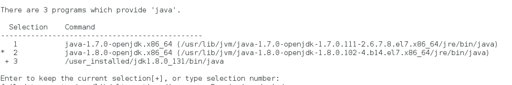

# Environment
  CentOS-7-x86_64-DVD-1611 + JDK 1.8 + Hadoop 2.7.3
  
# Java
  ## Show which java are you using
  > run command __*which java*__, this could be alias, then you need __*readlink $(which java)*__
  ## Installing your own JDK and setting as default one:
  1. wget  --no-cookies --no-check-certificate --header "Cookie: gpw_e24=http%3A%2F%2Fwww.oracle.com%2F; oraclelicense=accept-securebackup-cookie" "http://download.oracle.com/otn-pub/java/jdk/8u131-b11/d54c1d3a095b4ff2b6607d096fa80163/jdk-8u131-linux-x64.tar.gz", this command will down load the file to current folder.
  2. tar xzf jdk-8u131-linux-x64.tar.gz.
  3. alternatives --install /usr/bin/java java /user_installed/jdk1.8.0_131/bin/java 2 (*Installing JDK*).
  >  It's better for maintaining multiple versions of the software or libraries and easily switch between them by *alternatives*. Your applications are only pointing to the symbolic link, which you can easily switch any time and don't have to go through all the configurations of your applications. I don't know what the 20000 means, but here's the manpage: 
  4. sudo alternatives --config java (*Setting the alias pointing to your own JDK*).
  
        As you can seem the second one is the default one right now, Then you choose 3.
  5. You can also run the commands or just set up the ~./bashrc file for the JAVA_HOME. 
  
   ###### Run the commands:
        1. alternatives --install /usr/bin/jar jar /opt/jdk1.8.0_131/bin/jar 2.
        2. alternatives --install /usr/bin/javac javac /opt/jdk1.8.0_131/bin/javac 2.
        3. alternatives --set jar /opt/jdk1.8.0_131/bin/jar.
        4. alternatives --set javac /opt/jdk1.8.0_131/bin/javac.
  
   ###### Editing the ~/.bashrc file:
        export JAVA_HOME="/usr/lib/jvm/java-1.8.0-openjdk-1.8.0.102-4.b14.el7.x86_64/jre"
        export PATH="$PATH:$JAVA_HOME/bin"

  

# Steps
1. Download the release hadoop-X.Y.Z-src.tar.gz from a [mirror site](http://www.apache.org/dyn/closer.cgi/hadoop/common).
  * To perform a quick check using SHA-256:
  * Download the checksum hadoop-X.Y.Z-src.tar.gz.mds from [Apache](https://dist.apache.org/repos/dist/release/hadoop/common/).
  * sha256sum hadoop-X.Y.Z-src.tar.gz(performed on Mac)
2. Edit your *~/.bashrc* file for convenience.
    ###### format:
        export HADOOP_HOME="/home/patrick/software/hadoop/hadoop-2.7.3"
        export PATH="$PATH:$HADOOP_HOME/bin"
        
# Developing
1. IntelliJ: download and unzip the file. Then run "./idea.sh" in the bin folder. One trick is I have cncountered "intellij tartup Error: Unable to detect graphics environment" problem, it was solved by restarting.
2. 

# About CentOS
## Creat Desktop Shortcuts
### Regular
1. Click on Home directory on desktop. The nautilus (file browser) window will open.
2. Click the Computer tab in the left navigation panel, go to /usr/share/applications. All the applications icons will appear in the right browser window.
3. Right click desired icon (Firefox, Contacts etc)
4. After right clicking the icon, select Copy To in the context menu. A Select Destination will open up, pick Desktop folder in the left navigation panel (via left-click)
5. Left-click the Select button on the bottom right of the window.
### DIY
1. Creat XXX.desktop file in _/usr/share/applications_ floder
2. Update the content as below, for the exapmle of creating the shortcut for IntelliJ IDE.

        [Desktop Entry]
        Type=Application
        Terminal=false
        Exec=/bin/sh /home/xieerqi/intellij/idea-IC-145.597.3/bin/idea.sh
        Name=Intellij
        Icon=/home/xieerqi/intellij/idea-IC-145.597.3/bin/idea.png
3. Copying the _.desktop_ file to _~/Desktop_.

## Reference
  * https://superuser.com/questions/806448/how-to-make-a-desktop-icon-on-centos-7
  * https://unix.stackexchange.com/questions/253147/how-to-find-which-version-of-java-in-java-installed-folder
  * https://askubuntu.com/questions/763507/16-04-intellij-idea-desktop-entry-not-working
